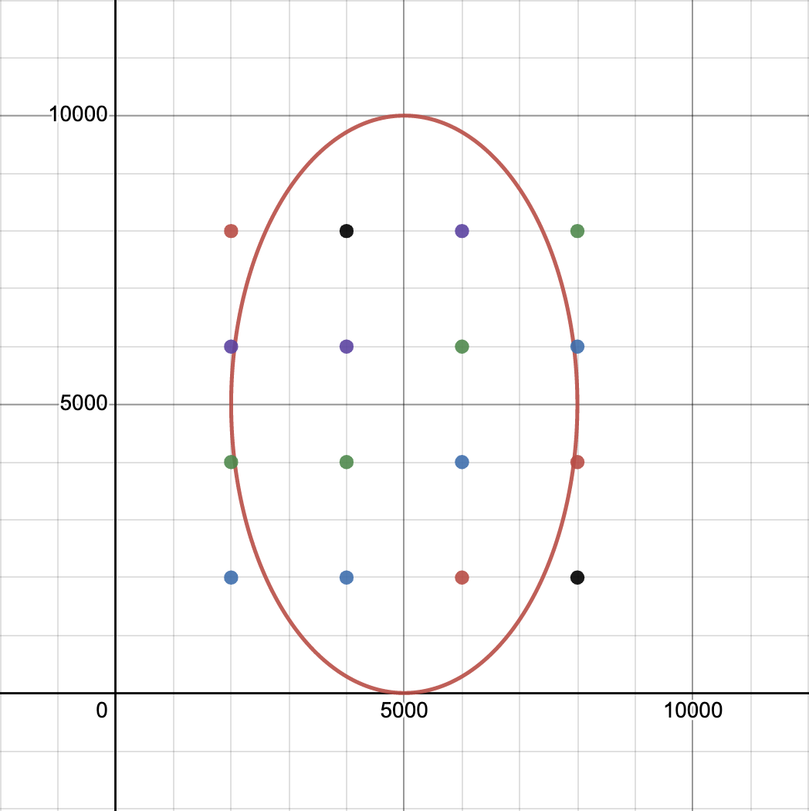

# Stop Detection Code Demo for EDM 2023

## Dependencies 

### Using conda 

The easiest way is to install dependencies using Anaconda and pip: 

```bash
conda create -n param_sweep python=3
conda activate param_sweep 
pip install -r requirements.txt
```

The above commands create an Anaconda virtual environment called `param_sweep` and use `pip` to install all dependencies. 

### Manual installation

You can also manually install the following libraries: 

- numpy
- pandas 
- tqdm 

## Getting started 

- `$ python stop_detection.py` to run stop detection algorithm on demo position data; 
- Open `parameter_optimization.ipynb` and run all code chunks to conduct parameter sweep on sample data. The output will be saved to `demo_data/demo_param_sweep_results_medium_resolution.csv`

## Project structure 

```
├── README.md
├── demo_data
│   ├── demo_obs_log.csv                                  # demo observation log, manually generated
│   ├── demo_param_sweep_results_medium_resolution.csv    # sample parameter sweep results using medium resolution grid
│   ├── demo_position_data.csv                            # demo teacher position data
│   ├── demo_seating_chart.csv                            # seating chart of 16 students in a 10m * 10m classroom
│   └── generate_demo_data.py                             # script to generate demo position data and seating chart
├── param_sweep.ipynb                                     # implementation of parameter sweep algorithm 
├── requirements.txt                                      # dependencies 
└── stop_detection.py                                     # implementation of stop detection algorithm 
```

## Demo data

To re-generate demo data as you may wish: 

```bash 
cd demo_data
python generate_demo_data.py
```

The virtual classroom setting in this demo dataset is a 10 meter by 10 meter square space. Students are seated 2 meters apart in both X and Y directions (see `demo_data/demo_seating_chart.csv` for more details). 

The script-generate teacher movement follows an ellipse shape, which is implemented by the following parametric functions: 

$$
X(t) = 3000\cos(0.3t)+5000
$$

$$
Y(t) = 5000\sin(0.3t)+5000
$$

Below is an illustration image of the teacher moving trajectory (oval curve, **counterclockwise**) and student seating (dots): 

<p align="center">
  
</p>

Please note that the length measurement unit is **millimeter** in the above graph, and the classroom is the square bounded by $0 \le x \le 10000$ and $0 \le y \le 10000$. 


